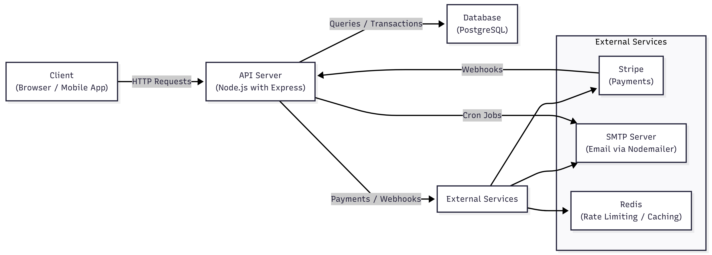

<div align="center">
  <h1>🔔 Maxisub API</h1>
  <p><strong>Production-Ready Subscription Tracker API</strong></p>
  
  <p>
    <a href="https://github.com/SajidenOfnir/maxisub-api/blob/main/LICENSE">
      
    </a>
    <a href="https://nodejs.org/">
      
    </a>
    <a href="https://github.com/SajidenOfnir/maxisub-api/actions">
      
    </a>
    <a href="https://github.com/SajidenOfnir/maxisub-api/issues">
      
    </a>
  </p>

  <p>
    A comprehensive REST API for managing subscriptions with authentication, notifications, payment integration, and analytics.
  </p>

  <p>
    <a href="#features">Features</a> •
    <a href="#quick-start">Quick Start</a> •
    <a href="#documentation">Documentation</a> •
    <a href="#contributing">Contributing</a> •
    <a href="#license">License</a>
  </p>
</div>

---

## 📸 Architecture 

<div align="center">
  
  <p><em>The Architecture of the system design</em></p>
</div>

---

## ✨ Features

- 🔐 **JWT Authentication** - Secure token-based authentication and authorization
- 📊 **CRUD Operations** - Complete subscription management
- 🔔 **Smart Notifications** - Automated email reminders for upcoming renewals
- 💳 **Payment Integration** - Stripe webhooks and payment processing
- 📈 **Analytics Dashboard** - Comprehensive spending insights and metrics
- 🎯 **RESTful Design** - Clean API design with versioning
- 📝 **API Documentation** - Interactive Swagger/OpenAPI docs
- 🐳 **Docker Support** - Fully containerized with Docker Compose
- ✅ **Testing** - Unit and integration tests with Jest
- 🔒 **Security** - Rate limiting, helmet, CORS, input validation
- 📉 **Logging** - Winston logger with multiple transports
- ⏰ **Cron Jobs** - Automated background tasks

---

## 🚀 Quick Start

### Prerequisites

- Node.js 18+
- PostgreSQL 15+
- Docker & Docker Compose (optional)
- Stripe Account (for payment features)

### Installation

1. **Clone the repository**
```bash
git clone https://github.com/SajidenOfnir/maxisub-api.git
cd maxisub-api
```

2. **Install dependencies**
```bash
npm install
```

3. **Set up environment variables**
```bash
cp .env.example .env
# Edit .env with your configuration
```

4. **Start the database**
```bash
# Using Docker
docker-compose up -d postgres redis

# Or use your local PostgreSQL
psql -U postgres -c "CREATE DATABASE maxisub;"
psql -U postgres maxisub < migrations/init.sql
```

5. **Run the application**
```bash
# Development mode
npm run dev

# Production mode
npm start

# Using Docker (all services)
docker-compose up
```

6. **Access the API**

- API Base URL: `http://localhost:3000/api/v1`
- API Documentation: `http://localhost:3000/api-docs`
- Health Check: `http://localhost:3000/health`

---

## 📚 Documentation

- [API Documentation](docs/API.md) - Complete API reference
- [Deployment Guide](docs/DEPLOYMENT.md) - Deploy to production
- [Architecture Overview](docs/screenshots/architecture.png) - System design

### API Endpoints

#### Authentication
POST   /api/v1/auth/register      - Register new user
POST   /api/v1/auth/login         - Login user
GET    /api/v1/auth/profile       - Get user profile
PUT    /api/v1/auth/profile       - Update profile

#### Subscriptions
POST   /api/v1/subscriptions      - Create subscription
GET    /api/v1/subscriptions      - List all subscriptions
GET    /api/v1/subscriptions/:id  - Get subscription by ID
PUT    /api/v1/subscriptions/:id  - Update subscription
DELETE /api/v1/subscriptions/:id  - Delete subscription

#### Analytics
GET    /api/v1/analytics/dashboard              - Get analytics
GET    /api/v1/analytics/notifications          - Get notifications
PUT    /api/v1/analytics/notifications/:id/read - Mark as read

---

## 🧪 Testing
```bash
# Run all tests
npm test

# Run with coverage
npm test -- --coverage

# Run integration tests
npm run test:integration

# Watch mode
npm run test:watch
```

---

## 🔧 Tech Stack

- **Runtime**: Node.js 18+
- **Framework**: Express.js
- **Database**: PostgreSQL 15
- **ORM**: Sequelize
- **Authentication**: JWT
- **Payment**: Stripe
- **Email**: Nodemailer
- **Caching**: Redis
- **Testing**: Jest & Supertest
- **Documentation**: Swagger/OpenAPI

---

## 🤝 Contributing

We welcome contributions! Please see our [Contributing Guide](CONTRIBUTING.md) for details.

1. Fork the repository
2. Create your feature branch (`git checkout -b feature/AmazingFeature`)
3. Commit your changes (`git commit -m 'Add some AmazingFeature'`)
4. Push to the branch (`git push origin feature/AmazingFeature`)
5. Open a Pull Request

Please read our [Code of Conduct](CODE_OF_CONDUCT.md) before contributing.

---

## 📄 License

This project is licensed under the MIT License - see the [LICENSE](LICENSE) file for details.

---

## 👥 Authors

- **SajidenOfnir** - [@SajidenOfnir](https://github.com/SajidenOfnir)

---

## 🙏 Acknowledgments

- Express.js team for the amazing framework
- Sequelize for the powerful ORM
- All contributors who help improve this project

---

## 📞 Support

- 🐛 Issues: [GitHub Issues](https://github.com/SajidenOfnir/maxisub-api/issues)
- 💬 Discussions: [GitHub Discussions](https://github.com/SajidenOfnir/maxisub-api/discussions)

---

<div align="center">
  <p>Made with ❤️ by <a href="https://github.com/SajidenOfnir">SajidenOfnir</a></p>
  <p>⭐ Star this repo if you find it helpful!</p>
</div>